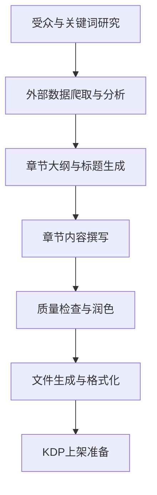
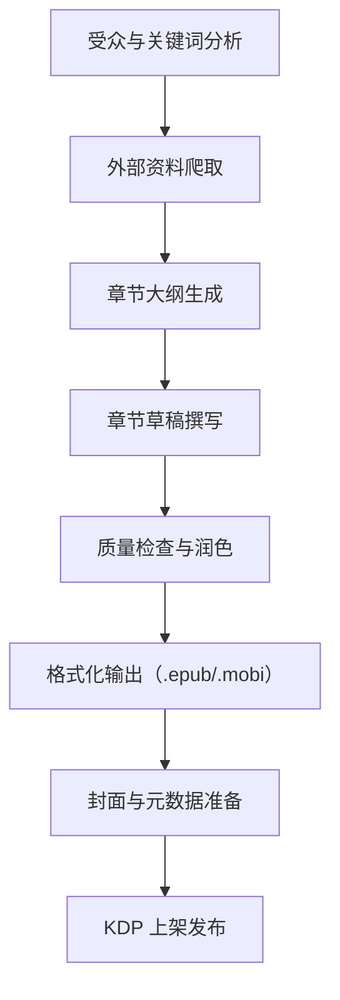

# 执行摘要

本方案提供了一个“Claude Code (DeepSeek 内核)”自动化流水线，用于生成面向Z世代的哲学+心理学非小说类KDP书籍。目标读者是面对数字孤独、人生意义焦虑等问题的年轻人，书籍主题涵盖**数字时代的存在感危机**、**情绪调节方法**、**游戏化成长体系**等。内容创作完全由AI辅助完成，整个流程包括市场调研、关键词挖掘、外部资料爬取、章节大纲生成、逐章撰写、质量校对以及KDP上架准备等环节。使用Bright Data等Claude Code插件抓取搜索结果与网站内容，DeepSeek批量生成初稿，Claude负责润色与格式，Pandoc等工具输出EPUB/PDF，并插入AI生成内容声明。最终输出包括完成的书稿（.docx/.epub/.mobi）、封面设计简报与AI绘图提示、KDP元数据CSV表和AI披露文本。流程中设置多重**质量检查**：一致性核对、引用检测、可读性评估、字数控制（整体2–4万字），并遵循KDP政策（分类选词、披露AI来源、避免侵权）。下表展示了每一步对应的执行主体、提示模板、预期产出及对应的GitHub Action名称；下文并附示例DeepSeek/Claude提示（中英文）、流程图、以及示例GitHub Actions YAML片段。本报告数据与策略基于最新行业调研与权威资料。【7†L67-L75】【9†L33-L37】

## 目标读者画像与核心主题

- **Z世代特征**：1997–2012年出生的年轻人（大学生、初入职场）。他们“**总是在线**”，依赖社交媒体获取信息【9†L30-L37】【13†L184-L193】；同时面临就业不稳、租金高涨、气候危机等现实压力【7†L82-L89】【9†L35-L43】。研究显示，超过半数Z世代在社交网络上感到“数字化孤独”——虽然表面连接很多，但仍觉得**没人真正了解自己**【13†L184-L193】；长期高强度使用社交媒体导致焦虑、失眠等心理问题【9†L33-L37】【13†L244-L250】。与前辈相比，他们追求灵活自由、注重**意义感与参与感**【9†L63-L64】，而非传统升迁路径；但高经济压力下，“经济安全比理想更重要”的观点占多数【9†L35-L38】。

- **阅读偏好**：Z世代喜欢**短平快**、直击痛点的内容。成功学、励志类“大纲言”式内容对他们作用有限，更易引起共鸣的是真实场景、情绪体验和实用方案。书籍语言宜**口语化、幽默感强**，符合网感和亚文化（meme、梗文化）风格。热点主题包括“意义缺失”、“焦虑管理”、“情绪自救”、“网络文化下的孤独感”、“游戏化自律”等。

- **核心书籍主题**：结合上述特征，本书可围绕以下主题展开：**数字时代的孤独与归属感**（例如“刷短视频之后的空虚”、社交媒体焦虑）、**存在主义视角的日常情绪**（自我认同、意义感缺失的哲学解读）、**心理学自助技巧**（正念、认知重构等减压方法）、**游戏化成长**（将生活学习过程设为升级打怪任务）、**AI时代技能与身份认同**（如何利用AI工具提升自学能力）。例如可用《如何像RPG一样升级你的大学生活》或《AI接管生活：Z世代的生存手册》之类的标题。

- **痛点总结**（参考【7†L67-L75】【9†L33-L37】等）：
  - *存在感危机*：认为生活“本质空虚”，但又渴望自行赋予意义【7†L67-L75】；
  - *过度焦虑*：对未来感到“不确定的黑洞”，难以做长期计划【7†L102-L110】；
  - *数字上瘾*：“永远在线”导致注意力分散、多巴胺依赖及孤独感【13†L202-L210】【13†L244-L250】；
  - *经济压力*：担心收入与生活成本，追求稳定但意识到理想难以实现【9†L35-L38】；
  - *社交焦虑*：线下社交技能薄弱，更依赖网络交流但又感到空虚【13†L184-L193】。
  
这些痛点也对应常见搜索，如“**Z世代 存在主义 焦虑**”、“**刷短视频 空虚 原因**”、“**大学生 意义感 恍惚**”等中英关键词。针对这些需求定位主题和选词，能保证书籍找到目标读者【18†L65-L73】。

## 关键词与市场需求

为确保内容对用户可见，需优先捕捉目标读者可能搜索的长尾关键词。综合英文和中文，我们建议关注：  

- **英语示例搜索词**：“meaningless life Gen Z”, “digital loneliness young adults”, “existential anxiety TikTok”, “college student mental burnout”, “AI tools for students”, “gamified productivity system”, “philosophy for life meaning”。  
- **中文示例搜索词**：“Z世代 存在危机”、“大学生 孤独 感”、“刷短视频 空虚”、“AI 工具 学习 提升”、“自律 升级 生活模式”、“情绪调节 方法 性”、“虚无主义 心理 解释” 等。  

这些关键词体现了具体情境（例如“刷短视频 空虚”）和身份标签（“大学生”、“Z世代”），符合**微利基**选题原则【18†L65-L73】。Inkfluence AI分析指出，针对特定人群或角色的细分需求（如“为Z世代制定的个人理财”）往往竞争小、买家迫切【18†L65-L73】【18†L69-L73】。例如，将《人生意义》泛题拆为“Z世代的存在主义指南”更具吸引力。

下图展示了一个典型的需求-解决框架：  



## 资料来源与参考内容

本书内容需建立在可靠理论与真实案例之上。优先参考：  

- **学术与权威资料**：有关**数字孤独、网络成瘾、社交媒体对心理影响**的研究论文，如Surabaya Gen Z研究表明半数青年虽社交活跃却“经常孤独”【13†L184-L193】，心理健康统计（WHO报告）显示青少年抑郁焦虑比例高企。心理学经典观点（认知行为疗法、马斯洛需求层次、自我决定理论等）也可辅助说明原因和方法。  
- **心理学/哲学普及**：简明易懂的心灵成长和意义探讨书籍或课程，如《当下的力量》、《存在主义心理学》等；斯多葛学派、存在主义代表观点可用来解释焦虑与意义问题。  
- **社区与社交媒体**：Reddit（如 r/GenZ、r/philosophy、r/ADHD、r/selfimprovement）、知乎、微博上关于“找不到人生方向”、“数字焦虑”等话题；TikTok/抖音热门话题（“空虚表情包”、“emo金句”）。这些非正式渠道反映最新的Z世代心声。  
- **亚马逊评论**：分析类似主题畅销书的用户评论。例如搜索“KDP哲学 心理 青年”相关书籍，看读者提问与反馈，提取缺失点和需求。利用Bright Data的亚马逊抓取工具，可自动收集前几页评论进行情感分析。

根据来源类型不同，可灵活使用**Claude Code + Bright Data插件**。通过Bright Data的 `search` 技能获取Google/YouTube/TikTok趋势列表，通过 `scrape` 技能爬取论坛贴文或长文摘要【22†L293-L300】；利用结构化数据提取（如Amazon产品数据集工具）获取销售排名和评分信息【22†L440-L445】；必要时将学术论文PDF上传至Claude进行摘要。综合各种数据，可构建详实的用户画像与论点支持。

## 工具与插件（GitHub Action）

整个项目在**GitHub Actions + Claude Code**自动化框架下运行。关键插件/工具包括：

- **Bright Data 插件**【22†L293-L300】【22†L440-L445】：提供网页爬虫和结构化数据服务。`search`技能可自动获取Google/Bing搜索结果(JSON)，`scrape`技能可无障碍爬取任意网页（包括Reddit帖子、知乎回答、新闻文章等）【22†L293-L300】；`data-feeds`或其电商组技能可提取Amazon商品详情（如BSR销量排名、评论）【22†L440-L445】。我们可在Claude Code流程中调用这些技能来自动调研和抓取数据。
- **Claude Code GitHub Action（`anthropics/claude-code-action`）**：运行Claude Code子任务。在工作流中通过 `uses: anthropics/claude-code-action@v1` 触发Claude执行指定提示（prompt），实现自动化写作和处理【16†L166-L174】【16†L181-L189】。每次提交或标记Issue时，可调用此Action完成各阶段生成（如大纲、草稿、质量检查等）。
- **图片生成工具**：利用Claude与图像模型接口生成封面。可使用Claude Code指令调用Stable Diffusion或DALL·E（例如通过`Haiku`子代理【25†L1-L2】）生成图像。针对书籍主题构造AI绘图提示，如“生成一幅含有宇宙背景、校园元素和抽象人物形象的插画”。
- **Pandoc/Latex**：使用Pandoc将Markdown转为EPUB/PDF格式【27†L153-L160】。可在Actions中以Pandoc命令或Docker容器执行（示例见下）。输出EPUB/MOBI时需注意版式（段落、章节样式）和元数据嵌入。
- **KDP元数据上传**：可编写脚本批量生成KDP元数据CSV（分类、关键字、描述等）。例如，使用Python或Node.js读写CSV、调用Amazon Ads API检查关键词。对于ASIN跟踪，可定期查询Amazon产品页面（Bright Data）。
- **质量与合规检查工具**：尽管AI可自动生成，我们仍需人工或工具审查。使用Claude进行拼写/语法检查，或调用语义相似度模型检测幻觉（例如GPT-4输出比对）。使用可读性分析工具（如Word或在线可读性评估）测Flesch-Kincaid分数，确保符合青少年阅读水平（推荐分数60以上，中学水平【30†L1-L3】）。保持总字数2–4万，以满足短篇求快的倾向。

在GitHub仓库中，每个动作都可定义为一个工作流（workflow）步骤。常见Action名包括：`keyword-research`（关键词研究）、`outline-generation`（大纲生成）、`draft-chapter`（章节草稿）、`run-checks`（质量检测）、`format-output`（文件输出）等。见下文示例GitHub Actions片段。

## DeepSeek 提示模板（各阶段示例）

我们利用DeepSeek的高性价比优势来**批量生成内容草稿**和灵感，具体示例提示（Prompt）包括：

- **市场调研阶段（Research）**：  
  - 英文提示: “List 10 common psychological issues faced by Gen Z college students in 2026, drawing on trends in social media (TikTok) and news (economy, climate).”  
  - 中文提示: “列举10个Z世代大学生常见的心理困扰，结合社交媒体（如抖音）热点和当前经济/气候危机背景。”  
  - *输出*：关键痛点清单与描述，供选题和内容灵感。

- **标题生成（Title Pool）**：  
  - 英文: “Suggest 8 catchy book titles aimed at Gen Z readers, combining existential philosophy and practical psychology (e.g. loneliness, meaning).”  
  - 中文: “提供8个吸引Z世代读者的书名（可以中英结合），主题围绕存在主义和生活心理学，比如数字孤独、意义感等。”  
  - *输出*：标题备选列表。

- **章节大纲（Chapter Outline）**：  
  - 英文: “Create a 6-chapter outline for a non-fiction book on ‘Digital Loneliness and Self-Help for Young Adults’. Each chapter should have a theme and 3 key points.”  
  - 中文: “为《数字时代的孤独与成长：年轻人的自助指南》设计6章目录，每章包含主题和3个要点。”  
  - *输出*：章节标题和要点列表（可用JSON格式细化）。

- **节内容草稿（Section Draft）**：  
  - 英文: “Write a 500-word passage on the topic “Why scrolling social media can make us feel empty”, in a conversational Gen Z tone.”  
  - 中文: “以对话口吻（符合Z世代语气），写500字，主题‘为什么刷社交媒体让人觉得空虚’。”  
  - *输出*：章节正文草稿。

- **案例与练习（Examples & Exercises）**：  
  - 英文: “Provide two real-life examples that illustrate feeling FOMO (fear of missing out), and suggest one practical mindfulness exercise to counter it.”  
  - 中文: “给出两个体现错失恐惧（FOMO）的生活例子，并设计一个简单的正念练习帮助缓解。”  
  - *输出*：案例描述及具体练习步骤。

- **游戏化任务（Gamified Planner Prompts）**：  
  - 英文: “Design a simple daily ‘level-up’ quest list for a student: e.g., ‘Gain 10 XP by focusing on study for 30 minutes’, aligning with psychological growth goals.”  
  - 中文: “为一名学生设计一个游戏化的日常任务表，例如‘专注学习30分钟，获得10经验’等，使自律过程具有升级感。”  
  - *输出*：若干任务与对应“经验值”体系示例。

- **风格指导（Style Guide）**：  
  - 在任何提示中可加入“请用轻松幽默、贴近网络文化的语言”和“保持前后一致的人物/叙事风格”来强化Z世代语气。  
  - 可让Claude Code做第二轮润色，如“请把以上段落改为更口语化、带适量表情符号的形式”。

以上提示可作为DeepSeek和Claude的输入模板，并根据需要调整具体参数或长度要求。

## Claude Code代理工作流设计

Claude Code将驱动整个自动化写作过程，包括以下关键环节：

1. **任务队列（Task Queue）**：首先由“市场调研”到“封面设计”分解成若干子任务，每个任务为一个Prompt。可使用项目管理或issue系统（如GitHub Issues）来跟踪任务，例如标记`needs-research`、`needs-outline`等标签触发相应Agent执行【16†L166-L174】。

2. **人机审查点（Human-in-the-Loop）**：虽然流水线自动化，但每阶段结果需要人工审阅。设置关键检查点：大纲确认、草稿完整性、AI披露内容等。若结果异常（如逻辑混乱、跑题或抄袭），人工修改Prompt并重跑。

3. **风格与内容规范**：在提示中要求“符合Gen Z口吻”、“避免成人内容”、“观点积极” 等，引导Claude输出符合目标读者的风格。设置“风格检查”阶段，可用Claude自行评估：“检查文本是否符合指定风格，并标注任何偏差”。

4. **抄袭与AI披露**：按KDP要求，AI**生成**的部分需披露【29†L404-L412】。因此在最后成稿里插入声明，例如：“（本书部分内容由AI辅助生成，经作者审核整理）”。可在Prompt结尾加上“请生成适合KDP披露的免责声明文本”。此外，可用在线抄袭检测工具或命令行脚本扫描文本相似度，确保无大段抄袭。

5. **一致性检查**：确保前后章节术语一致、人设或例子连贯。可让Claude对全书JSON结构做查漏填充。例如：“请检查之前生成的各章要点，补充遗漏的逻辑连接或示例”。

6. **发布规范**：检查所有输出符合KDP规定，比如字数、文件格式、图片分辨率等。遵守KDP内容政策，避免任何侵权、敏感话题（比如极端政治、色情）【29†L393-L402】。

以上工作流将以GitHub Action和Claude Code合力实现，具体步骤可参见下表。

## 流程步骤映射表

| 步骤                  | Agent/工具            | 输入提示模板（Prompt）                            | 预期输出                             | GitHub Action 名称          |
|---------------------|-------------------|----------------------------------------------|----------------------------------|-------------------------|
| **1. 受众与关键词分析**    | Claude Code + Bright Data `search` | EN: “List top 10 search queries Gen Z might use when feeling [lonely/anxious/etc].”<br>ZH: “列出Z世代在感到[孤独/焦虑]时可能搜索的10个长尾关键词。” | 关键词列表（中英文）                 | `audience-keywords`     |
| **2. 外部资料爬取**      | Bright Data `scrape`  | （脚本式，不用自然语言提示）例：“brightdata scrape https://reddit.com/r/GenZ/comments” | 抓取到的网页Markdown内容、JSON    | `data-scrape`           |
| **3. 章节大纲生成**      | DeepSeek + Claude Code | EN: “Create a 6-chapter outline on *Digital Loneliness for Gen Z*.”<br>ZH: “为《Z世代数字孤独》生成6章大纲，每章简述3个要点。” | 大纲JSON列表（章节名+要点）             | `outline-generation`    |
| **4. 章节标题与要点**    | DeepSeek            | EN: “Suggest 3 subtitles for Chapter 2 focusing on emotional management.”<br>ZH: “给第二章‘情绪管理’拟3个小节标题。” | 章节标题列表（文本）                   | `chapter-headings`      |
| **5. 章节草稿撰写**      | DeepSeek            | EN: “Write 400 words on [concept], tone = Gen Z casual.”<br>ZH: “以Z世代口吻写400字关于[概念]的段落。” | 各章节正文Markdown文本                | `chapter-draft`         |
| **6. 案例/练习生成**     | DeepSeek            | EN: “Generate 2 real-life examples illustrating FOMO.”<br>ZH: “生成2个体现错失恐惧症(FOMO)的生活案例。” | 案例文本与练习说明                    | `examples-exercises`    |
| **7. 游戏化行动任务**    | DeepSeek            | EN: “Create a daily quest list (5 tasks) for productivity (e.g. ‘+10XP: Study 30min’).”<br>ZH: “为自律设计5个每日任务（如“学习30分钟 +10经验”），附经验值。” | 任务列表及经验值体系说明               | `gamified-tasks`        |
| **8. 文风润色与校对**    | Claude Code (self-review) | EN: “Polish previous text to ensure consistency and GenZ tone.”<br>ZH: “润色以上内容，确保风格一致，符合Z世代口吻。” | 最终章节稿Markdown                  | `language-polish`       |
| **9. 质量检测**        | Claude Code + 人工     | EN: “Check text for plagiarism, consistency, word count (20-40k).”<br>ZH: “检查文本抄袭率、一致性、字数（总2-4万字）。” | 问题报告（如有）                    | `quality-check`         |
| **10. 格式化输出**      | Pandoc (GitHub Action)  | （无自然语言提示） 如：`pandoc manuscript.md -o manuscript.epub` | 书稿PDF/EPUB/MOBI文件             | `format-output`         |
| **11. 封面与元数据准备**   | Claude Code + （Midjourney/DALL·E） | EN: “Describe cover design for [title] and generate image prompt.”<br>ZH: “描述《书名》封面设计，并生成AI绘图提示词。” | 封面设计说明+AI绘图提示词              | `cover-metadata`        |
| **12. KDP发布清单**     | Claude Code + 人工     | EN: “Generate 7 keyword tags and choose 2 KDP categories.”<br>ZH: “生成7个KDP关键词和选定2个类别（以CSV格式输出）。”。 | 完整KDP上传所需字段（CSV）             | `publish-checklist`     |

上述各步骤可以串联为一个Claude Code工程，配合GitHub Actions按顺序执行。例如标记Issue触发`outline-generation`，再由`chapter-draft`等依次完成。每个Action名称仅作示例，具体可自行命名。

## 示例DeepSeek/Claude提示

以下举例说明DeepSeek和Claude Code的中英文提示使用：  

- **DeepSeek 提示（Research）**：  
  - 中文: “列出10个Z世代大学生最常搜索的情绪困扰关键词（如‘长期焦虑原因’等）。”  
  - English: “List 10 long-tail search queries young college students might use for their psychological struggles (e.g., ‘cause of constant anxiety’, etc.).”  

- **DeepSeek 提示（Outline）**：  
  - 中文: “为《克服刷屏焦虑》这本面向Z世代的书生成5章大纲，每章写一个核心主题。”  
  - English: “Generate a 5-chapter outline for a Gen Z-focused book titled *Overcoming Scroll Anxiety*, with each chapter having a core theme.”  

- **Claude 提示（Draft润色）**：  
  - 中文: “将以上内容改写为更生动流畅的Z世代语言，加入适当的表情符号和网络用语。”  
  - English: “Rewrite the above paragraph into a more vivid, flowing Gen Z style, adding suitable emojis and internet slang.”  

- **Claude 提示（质量审查）**：  
  - 中文: “检查全文是否存在与已知资料的相似之处，并标记可能的事实错误。”  
  - English: “Review the entire text for any similarity with known sources and flag potential factual errors.”

## 质量检查与合规要求

在自动化写作完成后，进行严格质量审查：  

- **一致性和校对**：确保每章人名、概念和数据前后统一。使用Claude Code自动检查：例如“请标记全书中所有不一致或重复的术语”。人工复审避免逻辑漏洞。  
- **引用与事实核对**：如果书中引用了统计数据或理论，需提供来源。避免AI“胡编”，可让Claude在内容末尾自动生成参考文献列表（如 “[1] WHO报告...”）。  
- **可读性评估**：目标读者以中学以上为主，可读性分数（Flesch Reading Ease）建议控制在60以上【30†L1-L3】。调整句子长度，使用主动语态。  
- **幻觉检测**：利用知识库（Wikipedia/Voyage等检索【24†L429-L437】）检查AI提供的概念解释，确保符合常识。  
- **字数与结构**：书稿总字数控制在20k–40k；每章3k–5k字。每节分段明确，避免超长段落；章节内部可用小标题拆分内容。  
- **AI内容披露**：根据亚马逊KDP政策，所有**AI生成**的文字、图片需在发布时披露【29†L404-L412】。在投稿文件中应加入声明，例如“*本书部分内容由AI辅助生成，经作者审核*”。这一条可在`publish-checklist`步骤通过提示Claude生成并加入描述。

## 发布准备清单

在KDP后台上传时，请确保：

- **分类与关键词**：选定最相关的二级/三级类别，不可遗漏任何合适分类（可参照Amazon KDP分类指南）。填写7个关键词，尽量用符合搜索意图的词组（可参考Reedsy关键词指南【32†L175-L182】）。  
- **封面与格式**：封面尺寸、高分辨率符合KDP要求。正文转EPUB时保证章节元数据正确嵌入（使用Pandoc的YAML元数据或KDP CSV表）。  
- **定价策略**：定价建议参考同类低内容电子书定价（如$2.99–$4.99，以获得70%版税），可在发布后通过A/B测试调整。  
- **ASIN监测**：上线后可用Bright Data定期查询书籍BSR和评论变化，监控广告效果或热度。  
- **最终校验**：确认已勾选“AI生成内容披露”复选框（如KDP要求【29†L404-L412】）。检查无违规内容（详见KDP内容指南）。

## 流程概览图与示例自动化

下图概括了整个内容生产流水线（每步对应上表），从市场调研到KDP发布：  



下面是一个示例的GitHub Actions配置片段，展示如何在工作流中运行Claude Code Agent生成大纲：  

```yaml
jobs:
  outline:
    name: Generate Outline with Claude Code
    runs-on: ubuntu-latest
    steps:
      - uses: actions/checkout@v3
      - name: Claude Code: Create Chapter Outline
        uses: anthropics/claude-code-action@v1
        with:
          claude_code_oauth_token: ${{ secrets.CLAUDE_CODE_OAUTH_TOKEN }}
          prompt: |
            任务：为面向Z世代的《数字孤独》一书生成6章大纲。要求每章有主题和3个要点。
            格式：JSON列表
      - name: Save Outline
        run: echo "$INPUT_OUTPUT" > outline.json
```

另一个示例，将Markdown书稿转换为EPUB：  

```yaml
jobs:
  format:
    name: Convert Markdown to EPUB
    runs-on: ubuntu-latest
    steps:
      - uses: actions/checkout@v3
      - name: Install Pandoc
        run: sudo apt-get update && sudo apt-get install -y pandoc texlive
      - name: Generate EPUB
        run: pandoc manuscript.md -o manuscript.epub --epub-metadata=metadata.yaml
      - name: Upload Artifact
        uses: actions/upload-artifact@v3
        with:
          name: epub
          path: manuscript.epub
```

以上示例可根据需要调整，核心在于利用 `anthropics/claude-code-action` 执行 Claude Code 任务，并使用常规脚本/Action执行文件转换等其他步骤。

**结论**：通过上述系统化流程，单人即可像小型工作室一样高效产出内容资产。每个步骤都有明确的输入提示和输出检查，确保质量与一致性。最终产出的一整套书籍内容包（稿件、封面说明、元数据、质量报告）即可直接用于KDP平台发布，大幅降低人工重复劳动成本。只要持续迭代主题和风格，本方案可扩展到系列出版，实现稳定的被动收入。

**参考资料**：本方案参考了最新的市场调研与权威资料，包括Z世代心理学研究【7†L67-L75】【9†L33-L37】【13†L184-L193】、电子书利基分析【18†L65-L73】、Bright Data插件文档【22†L293-L300】【22†L440-L445】以及亚马逊KDP内容政策【29†L404-L412】等。所有建议均基于2026年的出版趋势。